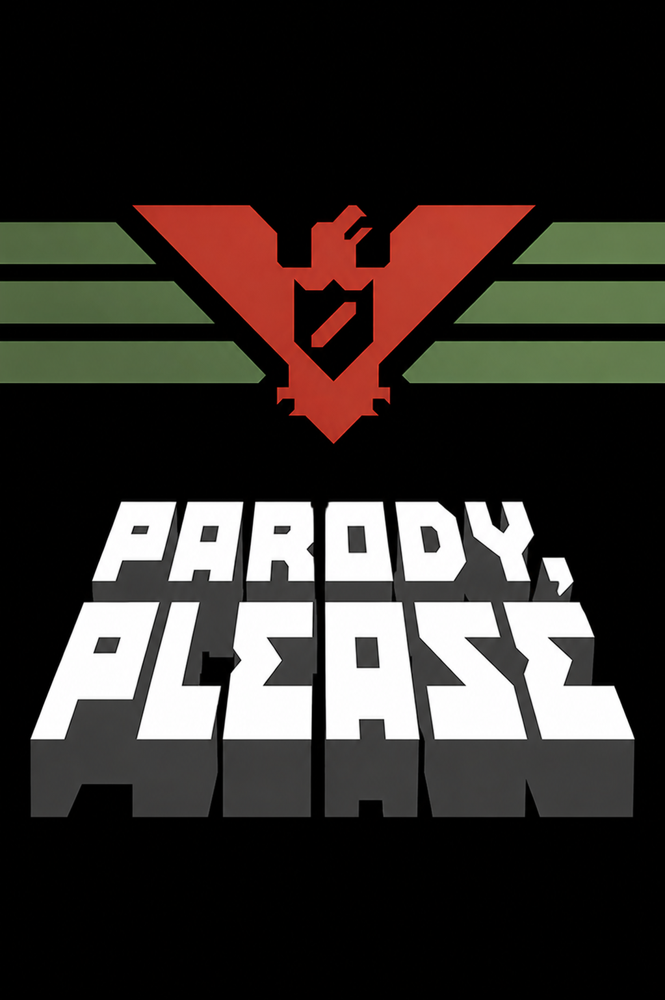

# Parody, Please

<p align="center">
  
</p>

Write your own *Papers, Please* style ending: pick a picture, type the report
line, add a scene, repeat. Then either watch it play back like a little game
and record it, or render a real mp4.

Nothing about the ending is fixed. The last scene you write is the last scene
of the video.

---

## Two ways to use it

### In the browser (nothing to install)

Open the [GitHub Pages site](https://j0k3v.github.io/parody-please/), build your
scenes and press **PLAY**. Press **RECORD** to save it as a `.webm`.

Everything you import - your own pictures and sounds - is stored in the browser
through IndexedDB, so closing the tab does not lose your work. The project you
are editing is autosaved as well.

To run it locally you need a web server, because the page loads modules and a
font. Opening `index.html` straight from disk will not work:

```bash
python -m http.server 8000
# then visit http://localhost:8000
```

### On the desktop (renders a real mp4)

A native application: a single 4 MB executable that opens in under a second and
draws at several hundred frames a second, because the stage lives on the GPU
rather than being rebuilt in software each frame.

Download it from the releases page, unpack it anywhere and run it. Nothing else
to install.

Render a saved report without opening the window:

```
ParodyPlease.exe --render projects\default.json out.mp4
```

Both open on the game's own ending so there is something to press play on.
Neither ever starts playing by itself.

---

## Building the native editor

```bash
python tools/get_libraries.py     # raylib and the json header
python tools/get_ffmpeg.py        # ffmpeg, too big for the repository
cd native && mingw32-make
```

You need a C++ compiler. [w64devkit](https://github.com/skeeto/w64devkit/releases)
is a single portable download with no installer.

---

## How the video is put together

Each scene runs through the same beats, at 30 fps:

| Step | Length |
| --- | --- |
| The picture wipes in from the right | 21 frames |
| A beat of stillness | 6 frames |
| The report is typed out | 2 frames per letter |
| The finished line holds | 60 frames |
| The picture alone, then the page turn | 3 frames |

The last scene holds for 5 seconds instead.

The report sits in an 800 px column centred on the frame, from x=240 to x=1040,
and wraps inside it. That is what keeps it square under the picture: pinning
the text to the left edge makes it drift away from everything else. Each scene
picks its own alignment inside that column, so the closing line can sit under
the emblem the way the game does it.

### Sound

Every file keeps the name it has in the game.

| Role | Bad ending (default) | Good ending | Main theme |
| --- | --- | --- | --- |
| Music, under everything | `BadEnding` | `GoodEnding` | `MainTheme` |
| Page turn between scenes | `ButtonUp` | `ButtonUp` | `ButtonUp` |
| Typing, one at random per click | `TextReveal0-3` | same | same |

Two of the files turned out to be copies of others: `Death.wav` is the bad
ending sample for sample, and `Theme.wav` was the main theme again with a longer
tail. Each piece is kept once, under its own name.

A scene can also carry a one-off sound, and its own music which plays on into
the following scenes rather than restarting. The sound can fire as the scene
opens, as its line finishes typing, as it ends, or a set number of seconds in.

Watching a report is not the same as rendering one. On screen the score is put
on its own stream and left alone: it runs on real time, loops when it reaches
the end of the track, and carries straight through however long a scene waits on
its NEXT button - the music has nothing to do with the paperwork. The effects
are fired one at a time as the picture reaches them. A rendered video has no
buttons to wait on, so there everything is mixed down together and stops when
the last scene does.

Three sliders beside the booth set the listening volume - everything, the
score, the effects - in both editors. They shape what the speakers do, never
what a render or a recording writes: those always come out at full level.

---

## Layout

```
index.html              the web editor (this is what GitHub Pages serves)
web/                    its stylesheet, engine and storage layer
native/src/             the desktop editor, in C++
  layout.h              every position and timing, in one place
  timeline.cpp          when everything happens, in frames
  stage.cpp             drawing a frame: picture, text, button, pointer
  mixer.cpp             the soundtrack, summed into one buffer
  player.cpp            live playback: the score on the audio thread
  editor.cpp            the window
  exporter.cpp          frames piped straight into ffmpeg
  booth.cpp             the booth wall, its shutter and the lever
  file_dialog.cpp       the system's open and save panels
assets/
  images/default/       the game's own frames, under their own names
  images/custom/        hand-made artwork (not published)
  images/sprites/       booth parts, the NEXT button, the pointers
  sounds/default/       the game's sound effects and score
  fonts/                the pixel font
projects/               saved reports as json
tools/                  helper scripts
```

`assets/manifest.json` lists everything the browser can load, since JavaScript
cannot read a directory. Regenerate it after adding files:

```bash
python tools/build_manifest.py
```

---

## Notes

- The pixel font shipped with the original project has a malformed `cmap`
  table. Pillow ignores it, but every browser rejects the file outright, which
  silently killed the whole look on the web. `tools/fix_font.py` rewrites it and
  emits a `.woff2`; the metrics are unchanged.
- Pillow sizes a font by its em square and raylib rasterises to a pixel height,
  so asking both for "40" gives text about two per cent apart - invisible, but
  quite enough to move a line break. The native editor measures with the table
  in `tools/export_font_metrics.py`, so its wraps land exactly where the
  browser's do.
- The game's own frames are 240x160 and get doubled to fill the picture box.
  The filter is picked by direction: nearest neighbour going up so the pixels
  stay hard, smooth going down for photographs.
- Browser recording happens in real time. The native renderer does not have
  that limit: it writes a 35 second video in about 15 seconds.

---

## Credits

**[*Papers, Please*](https://papersplea.se/) is by Lucas Pope.** Every frame in
`assets/images/default/`, every sound in `assets/sounds/default/` and the music
are his work, and this whole thing only exists because that game is what it is.
They are used here for a free, non-commercial fan project, made by a fan for
fans, and are not covered by this repository's licence. If Lucas Pope or 3909
would rather they were not here, say the word and they come straight out.

This is free, and meant to stay free. The artwork in `assets/images/custom/` is
original and is not published.

The code is MIT, see [LICENSE](LICENSE).
